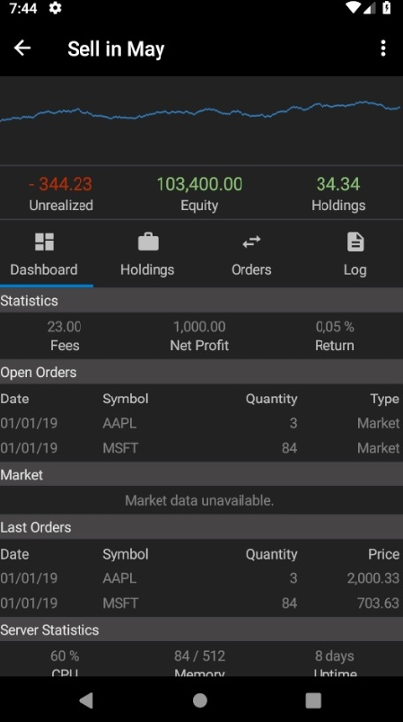

Lean Algorithm Monitor Mobile
=============================

## Introduction ##

This project aims to create a mobile (phone, tablet) application that provides functionality to monitor live-running LEAN algorithms. 

 - [QuantConnect Forum Topic](https://www.quantconnect.com/forum/discussion/5266/development-of-a-mobile-app/p1)
 - [UserEcho](https://leanmobile.userecho.com/)
 - [Desktop version](https://github.com/mirthestam/lean-monitor)

It aims to show important information with which one can see how a live algorithm is performing and possibly intervene if necessary. Device notifications that can be initiated by the algorithm (based upon the `Notify` method) further contribute to this functionality.

Users see important information of their live algorithms at a glance such as the strategy equity charts and essential algorithm statistics like equity, holdings and unrealized profits.

When selecting a single algorithm, a dashboard provides quick access to the strategy equity chart, essential statistics, open orders, the last orders and their server statistics. Additional tabs provide access to the holdings list, algorithm logs and the order history. Users can perform essential actions like stopping or liquidating their algorithms.

The proof-of-concept is currently based on Android. Because Xamarin is used, an iOS version can easily be realized in the future.

## Current state of development ##

A rough structure of the application architecture has been set up. We looked at the communication with the API, an abstraction layer and the display of data in the application.

Some effort has been put into designing the various screens of the user interface which are currently mainly provided with placeholder data. I have tried to follow the use of color and the light and dark themes of the QuantConnect cloud.

No code has yet been written for displaying graphs. Further research into suitable libaries or custom drawing is required.

Development of this application has been stopped until further notice.
 
Although the data contract of the API implies that all required data is available, it is in many cases left empty by the QuantConnect cloud. QuantConnect has announced that it wants to explore the possibilities of supplying this data via the API at a later stage. The findings are placed in comment blocks in the code in the `LeanMobile.Data` project.

Support for the open source LEAN engine is currently not possible because no open source implementation of the API is available. Only the API contract has been made available. An implementation will first have to be developed before this monitor can communicate directly with the LEAN engine.

In addition, QuantConnect is currently developing an Electron-based desktop environment. It is not yet clear whether this environment will be open source or part of the QuantConnect cloud and its private APIs. If it is going to use the public API, it is likely that the methods I need will become available in the future.

In addition, it is not unlikely that the further development of this Electron app into a mobile version is a good alternative to the development of this Xamarin application.

